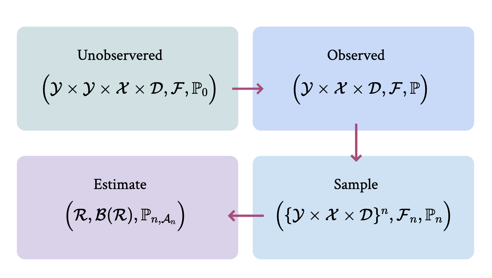

In many applied contexts we are interested in the behavior of the estimator and the interpretation of the estimate. Our starting point for this discussion is a probability space. Well, actually several of them, but they can be understood as transformations of the original one, so let's start there. 

-   __Unobserved__

    $$\Big( \mathcal{Y} \times \mathcal{Y} \times \mathcal{X} \times \mathcal{D}, \mathcal{F}, \mathbb{P}_0\Big)$$

-   __Observed__

    $$\Big( \mathcal{Y} \times  \mathcal{X} \times \mathcal{D}, \mathcal{F} , \mathbb{P}\Big)$$

-   __$Sample$__

    $$\begin{align*}
    &D_{i}:: \Omega \to \mathcal{R} \\ 
    &D_{i} \ (\_ \ \_ \ d) =  d
    \end{align*}$$

-   __$Y_i$__

    $$\begin{align*}
    &Y_{i}:: \Omega \to \mathcal{R} \\ 
    &Y_{i} \ (y_0 \ y_1 \ d) =  dy_1 + (1-d)y_0
    \end{align*}$$

<!-- <figure markdown>
  { width="500" }  
</figure> -->

Given this probability space, we can then define the random variables of interest as follows: 

-   __$Y_{i0}$__

    $$\begin{align*}
    &Y_{i0}:: \Omega \to \mathcal{R} \\ 
    &Y_{i0} \ (y_0 \ \_ \ \_) =  y_0 
    \end{align*}$$

-   __$Y_{i1}$__

    $$\begin{align*}
    &Y_{i1}:: \Omega \to \mathcal{R} \\ 
    &Y_{i1} \ (\_ \ y_1 \ \_) =  y_1
    \end{align*}$$

-   __$D_i$__

    $$\begin{align*}
    &D_{i}:: \Omega \to \mathcal{R} \\ 
    &D_{i} \ (\_ \ \_ \ d) =  d
    \end{align*}$$

-   __$Y_i$__

    $$\begin{align*}
    &Y_{i}:: \Omega \to \mathcal{R} \\ 
    &Y_{i} \ (y_0 \ y_1 \ d) =  dy_1 + (1-d)y_0
    \end{align*}$$

We can say that treatment is indepdent of the potential outcome if the corresponding $\sigma$-algebras are independent. More intuitively, this is equivalent (as shown [here](https://youtu.be/gHcAbLam5h0?list=PLbMVogVj5nJQqGHrpAloTec_lOKsG-foc&t=526)).

$$\forall B_1,B_2 \in \mathcal{B}(\mathcal{R}), \quad \mathbb{P}(D_i \in B_1, Y_{i0} \in B_2) = \mathbb{P}(D_i \in B_1)\mathbb{P}(Y_{i0} \in B_2)$$

### **Working Across Probability Spaces**

#### **Independence**
you will often here that treatment is independent of the potential outcomes. While you probably have an intuitive sense of what this means, it can be helpful to formally define this. To start, let's consider the following probability spaces: 

#### **Expectations**

Many terms/properties can be understood as working across multiple probability spaces.

$$\int _A fd\mathbb{P} = \int_{f(A)} x d\mathbb{P}_f$$

??? warning "To Do"

    is $f(A)$ a measurable set??