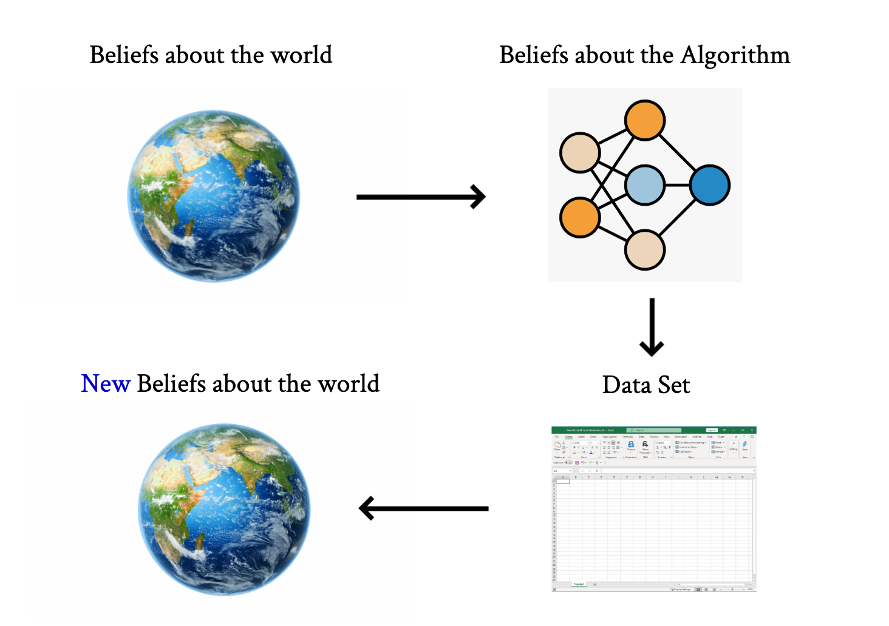
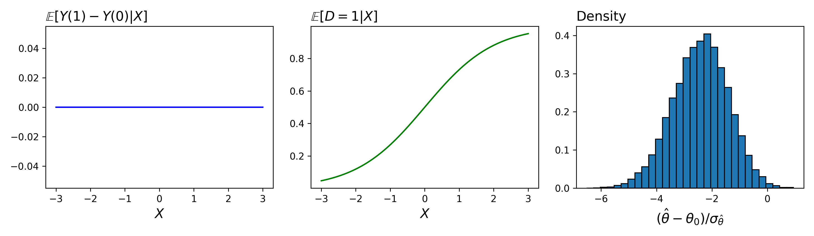

<h1 style="text-align: center;color:#404065;font-weight:bold;">Econometrics</h1>

<!-- 
Applied Econometrics is a highly personalized endevour
 -->

<h2 style="text-align: left;color:#404065;font-weight:bold;">Introduction</h2>

Applied econometrics is fundamentally about **interpretation** -- how to interpret the result of a statistical procedure in a given context. Often, there isn't often a "valid" or "correct" interpretation. Much like a work of art, there are multiple interpretions available to statistical results. In line with this thinking, we're not going to emphasize a particular way to interpret results. Rather, we would like to introduce you to the statistical and computional tools as well as provide you with a broad set of real life examples so that you can further develop your own **judgement**. 

#### Learning from Data

Learning from data, especially finite data where the estimand of interest has a causal interpretation is a highly personalized process. The general setup of the process is reflected visually below. We have beliefs about the world; we have beliefs about how a statical procedure behaves under certain conditions; the statistical procedure is applied to a data set providing use with numerical "results" which ultimately shape our new beliefs about the world. 

<figure markdown>
  { width="500" }
</figure>

#### Models 

We will never assume that the relationship is linear and moreover, we're not going to be centrally focused on fitting linear models

<figure markdown>
  { width="900" }
  Under selection on observables, linear regression can perform poorly: Reproduced <a href="https://github.com/pharringtonp19/econometrics/blob/main/notebooks/approximation/Linear_Issues.ipynb">Here</a>
</figure>

We'll work from a more general setup 

$$Y_i(D) = f(X_i, D) + \varepsilon_i(D)$$

<h2 style="text-align: left;color:#404065;font-weight:bold;">Components</h2>

-   __Approximation__

    ---

    TBD

    ---
    [:octicons-arrow-right-24: Getting started](chapters/real world events/introduction.md)

-   __Optimization__

    ---

    TBD

    ---
    [:octicons-arrow-right-24: Getting started](chapters/optimization/introduction.md)

-   __Probability Theory__

    ---

    TBD

    ---
    [:octicons-arrow-right-24: Getting started](chapters/Uncertainty/introduction.md)

-   __Programming__

    ---

    TBD
    
    ---
    [:octicons-arrow-right-24: Getting started](chapters/math on the computer/introduction.md)

 